# Домашнее задание к занятию 11 «Teamcity» - Шаров Олег

## Описание проекта

Настроен пайплайн непрерывной интеграции и доставки (CI/CD) для Java-проекта с использованием:
- **TeamCity** — сервер непрерывной интеграции
- **Nexus Repository** — хранилище артефактов
- **Maven** — сборка и деплой
- **GitHub** — система контроля версий

## Архитектура

```
GitHub (исходный код)
    │
    ▼
TeamCity Server (51.250.64.238:8111)
    │
    ├── Build (все ветки) → mvn clean test
    │
    └── Build-Master (только master) → mvn clean deploy
            │
            ▼
        Nexus (51.250.83.21:8081)
        └── maven-releases
            └── org.netology:plaindoll:0.0.2
```

### Инфраструктура

| Компонент | IP-адрес | Назначение |
|-----------|----------|------------|
| TeamCity Server | 51.250.64.238:8111 | CI сервер |
| TeamCity Agent | 51.250.82.245 | Агент сборки |
| Nexus | 51.250.83.21:8081 | Репозиторий артефактов |
| GitHub | github.com/Myth3916/example-teamcity | Исходный код |

## Настройка сборок

### Build (для всех веток)

- **Назначение**: проверка кода и запуск тестов при любом изменении
- **Команда**: `mvn clean test`
- **Триггер**: VCS trigger на все ветки (`+:*`)
- **Параметры**: `mavenGoals = clean test`

### Build-Master (только для ветки master)

- **Назначение**: деплой артефакта в Nexus после мержа в master
- **Команда**: `mvn clean deploy`
- **Триггер**: VCS trigger только на master (`+:refs/heads/master`, `-:refs/heads/*`)
- **Параметры**:
  - `mavenGoals = clean deploy`
  - `nexus.url = http://51.250.83.21:8081/repository/maven-releases/`
  - `nexus.username = teamcity`
  - `nexus.password = teamcity123`

## Nexus Repository

- **Репозиторий**: `maven-releases` (maven2 hosted)
- **Deployment policy**: Allow redeploy
- **Пользователь для деплоя**: `teamcity` (роль nx-admin)

## Как это работает

1. **Разработчик создает feature-ветку** и пушит изменения в GitHub
2. **TeamCity автоматически запускает сборку Build** (только тесты)
3. **После code review изменения мержатся в master**
4. **TeamCity автоматически запускает Build-Master** (деплой в Nexus)
5. **Артефакт `plaindoll-0.0.2` появляется в Nexus** и доступен для других проектов

## Скриншоты

### 1. Список сборок Build (все ветки)
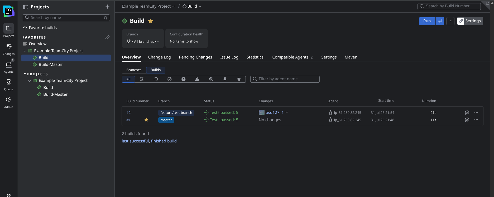
*Сборка Build запускается для всех веток, включая feature/test-branch и master*

### 2. Список сборок Build-Master (только master)
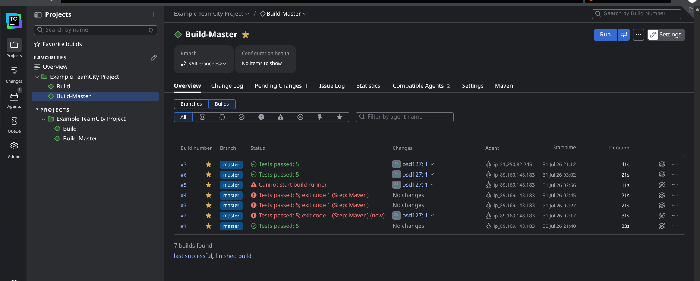
*Build-Master запускается только для ветки master*

### 3. Успешная сборка Build-Master #7
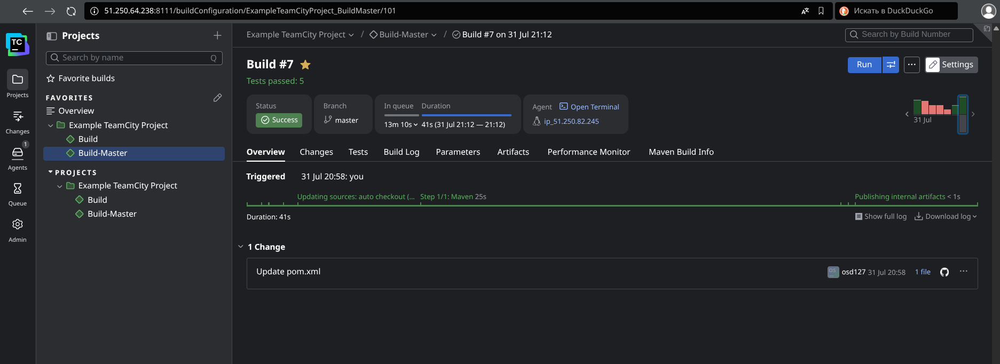
*Успешный деплой артефакта в Nexus*

### 4. Артефакт в Nexus
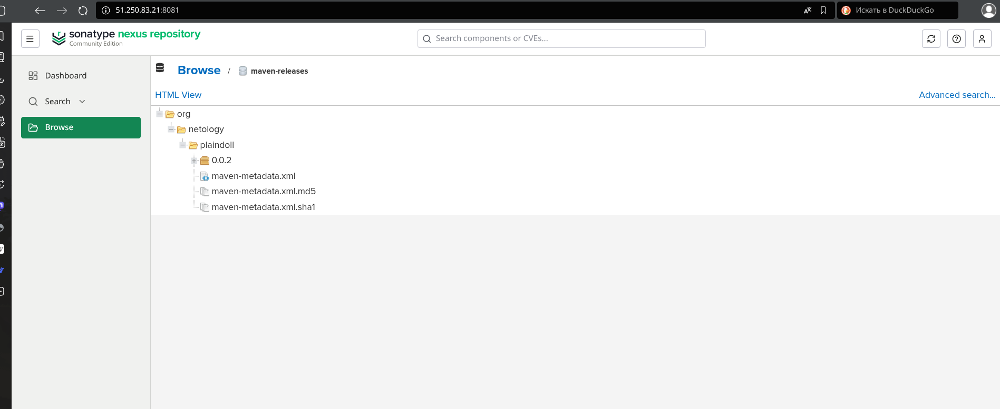
*Артефакт org.netology:plaindoll:0.0.2 в репозитории maven-releases*

### 5. Настройки триггеров Build
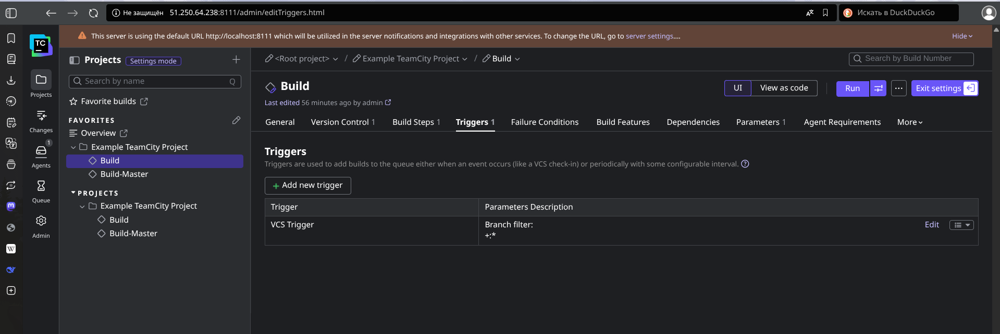
*VCS Trigger для всех веток (+:*)*

### 6. Настройки триггеров Build-Master
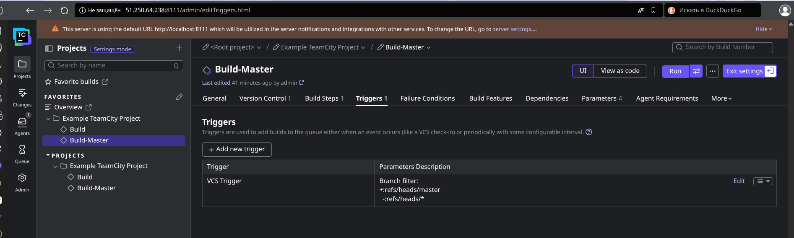
*VCS Trigger только для master (+:refs/heads/master, -:refs/heads/*)*

### 7. Настройки Build Steps — Build
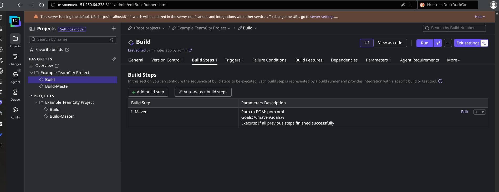
*Maven с goals %mavenGoals% (clean test)*

### 8. Настройки Build Steps — Build-Master
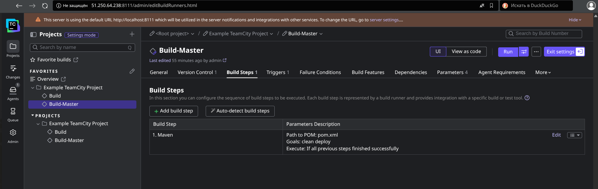
*Maven с goals clean deploy*

### 9. Параметры сборки Build
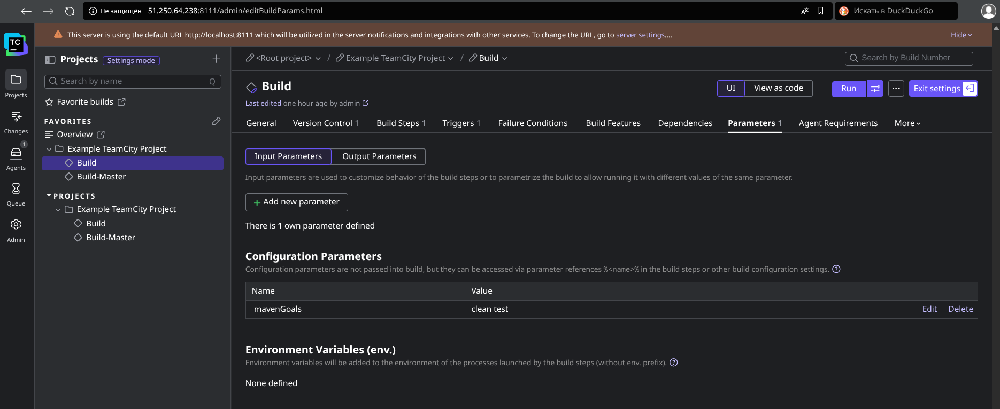
*Параметр mavenGoals = clean test*

### 10. Параметры сборки Build-Master
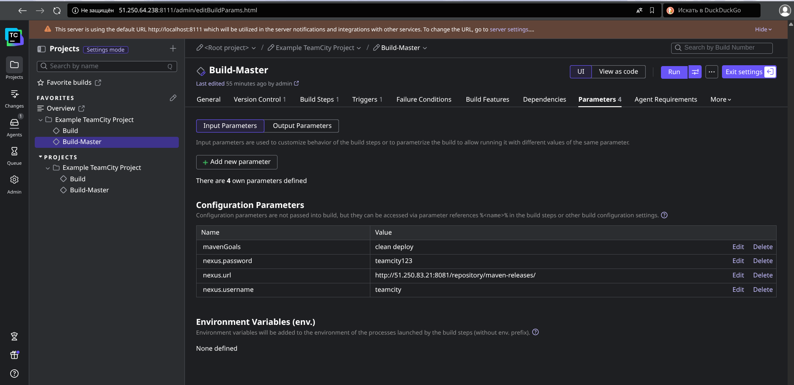
*Параметры для подключения к Nexus*

### 11. Пользователь teamcity в Nexus
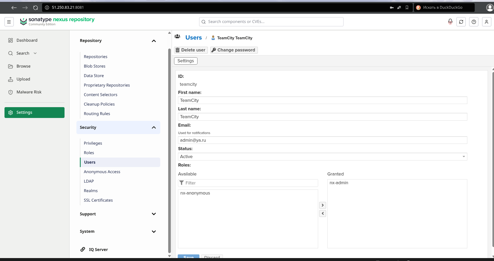
*Пользователь teamcity с ролью nx-admin*

### 12. Файл pom.xml
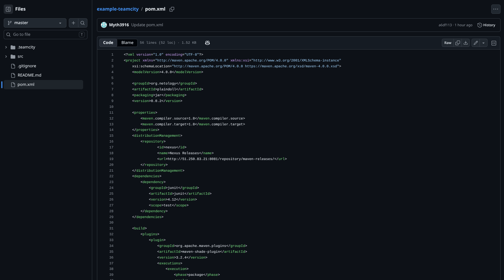
*Секция distributionManagement с URL Nexus*

### 13. Файл settings.xml
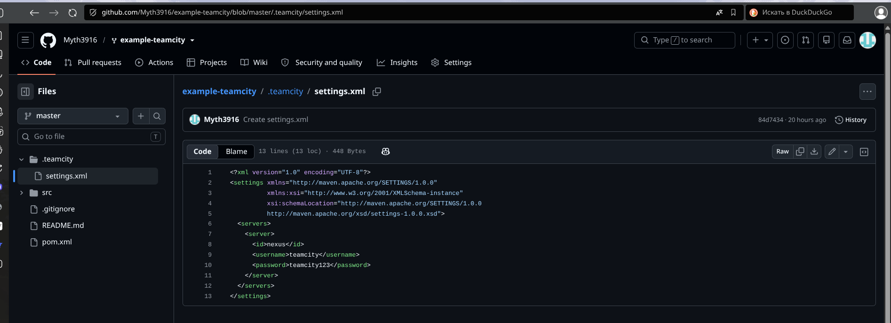
*Credentials для аутентификации в Nexus*

### 14. VCS Root в TeamCity
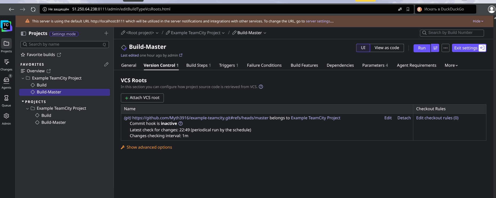
*Подключение к GitHub репозиторию*

## Файлы проекта

- `pom.xml` — конфигурация Maven с distributionManagement
- `.teamcity/settings.xml` — credentials для Nexus
- `src/` — исходный код проекта
- `README.md` — этот файл

## Технологии

- Java 8
- Maven 3.9.11
- TeamCity 2024
- Nexus Repository 3.x
- Docker
- Git / GitHub


---

## 📁 Структура репозитория после оформления

```
example-teamcity/
├── .teamcity/
│   └── settings.xml
├── src/
├── screenshots/
│   ├── 01_build_list.png
│   ├── 02_build_master_list.png
│   ├── 03_build_master_success.png
│   ├── 04_nexus_artifact.png
│   ├── 05_build_triggers.png
│   ├── 06_build_master_triggers.png
│   ├── 07_build_steps.png
│   ├── 08_build_master_steps.png
│   ├── 09_build_params.png
│   ├── 10_build_master_params.png
│   ├── 11_nexus_user.png
│   ├── 12_pom_xml.png
│   ├── 13_settings_xml.png
│   └── 14_vcs_root.png
├── terraform/
│   ├── main.tf
│   ├── provider.tf
│   ├── variables.tf
│   ├── outputs.tf
│   └── .terraform.lock.hcl
├── .gitignore
├── pom.xml
└── README.md
```
